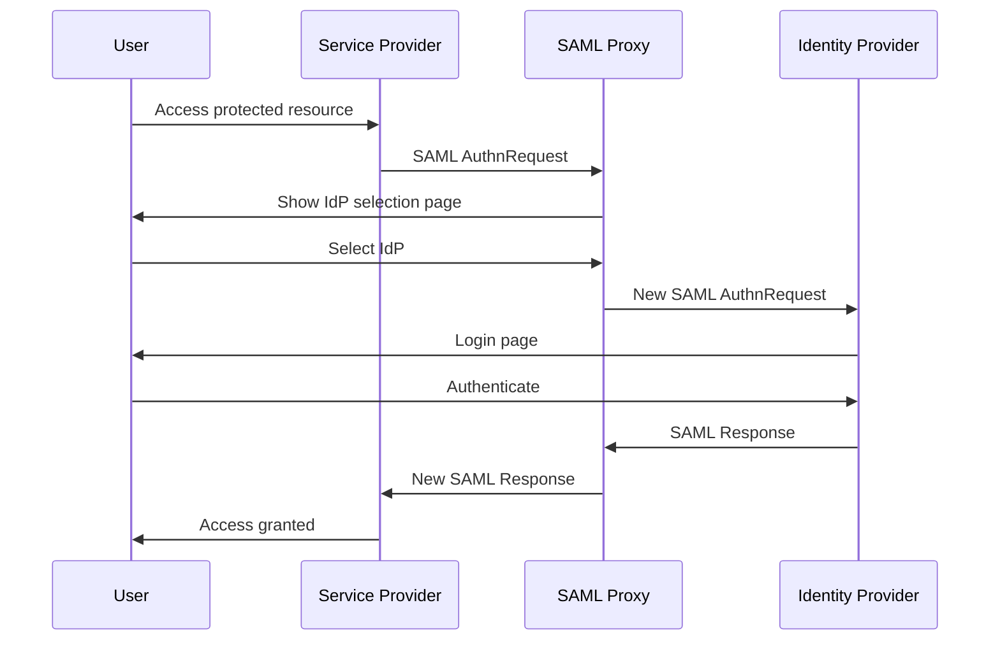
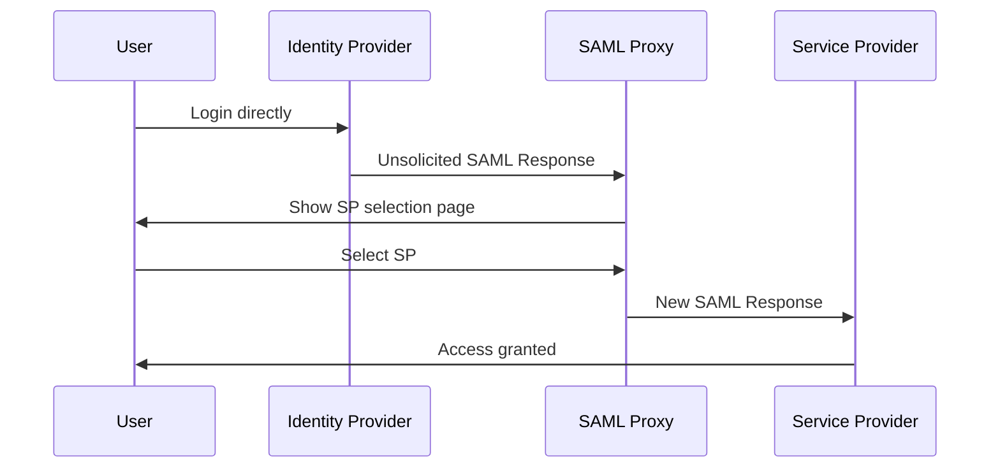

# Simple SAML Proxy

[](https://github.com/sters/simple-saml-proxy/actions?query=workflow%3AGo)
[](https://github.com/sters/simple-saml-proxy)
[](https://goreportcard.com/report/github.com/sters/simple-saml-proxy)

A lightweight and easy-to-use SAML proxy that enables multi-tenant SSO capabilities for applications that only support single-tenant SSO.

## What is Simple SAML Proxy?

Simple SAML Proxy is **NOT a traditional request/response proxy** that just forwards SAML messages. Instead, it's an intelligent intermediary that acts as:

- **Identity Provider (IdP)** to your Service Providers
- **Service Provider (SP)** to your Identity Providers

This dual-role pattern enables single-tenant applications to authenticate users from multiple Identity Providers through a single integration point.

## Key Features

### 🚀 **Zero Infrastructure Dependencies**
- No database required
- No persistent cache or storage  
- No configuration files
- Single binary deployment
- All configuration via environment variables

### 🏢 **Multi-Identity Provider Support**
- Connect multiple Identity Providers simultaneously
- User-friendly IdP selection interface
- Support for both SP-initiated and IdP-initiated flows

### 🔐 **Enterprise Security**
- Full XML digital signature validation
- Configurable Single Logout (SLO) support
- TLS/HTTPS deployment ready
- Certificate-based authentication

### ⚡ **Production Ready**
- Comprehensive test coverage
- Docker support with examples
- Integration testing with Keycloak
- Detailed monitoring and logging

## Use Cases

Perfect for organizations that need to:

✅ Connect single-tenant applications to multiple Identity Providers  
✅ Avoid complex identity federation systems  
✅ Deploy quickly without database setup  
✅ Provide users with IdP choice during authentication  
✅ Maintain security with signature validation  

## Quick Start

### Installation

```shell
# Install latest version
go install github.com/sters/simple-saml-proxy@latest

# Or download from releases
wget https://github.com/sters/simple-saml-proxy/releases/latest
```

### Basic Configuration

Create your certificates:
```bash
# Generate private key
openssl genpkey -algorithm RSA -out proxy-private.key -pkcs8

# Generate certificate
openssl req -new -x509 -key proxy-private.key -out proxy-cert.crt -days 365
```

Set environment variables:
```bash
# Proxy configuration
export PROXY_ENTITY_ID="https://your-proxy.example.com"
export PROXY_ACS_URL="https://your-proxy.example.com/acs"
export PROXY_PRIVATE_KEY_PATH="./proxy-private.key"
export PROXY_CERTIFICATE_PATH="./proxy-cert.crt"

# Identity Provider configuration
export IDP_0_ID="your-idp"
export IDP_0_ENTITY_ID="https://your-idp.example.com"
export IDP_0_SSO_URL="https://your-idp.example.com/sso"
export IDP_0_CERTIFICATE_PATH="./idp-cert.crt"

# Service Provider configuration  
export PROXY_ALLOWED_SP_0_ENTITY_ID="https://your-app.example.com"
export PROXY_ALLOWED_SP_0_ACS_URL="https://your-app.example.com/acs"

# Server configuration
export SERVER_LISTEN_ADDRESS=":8080"
```

### Run the Proxy

```bash
simple-saml-proxy
```

Your proxy will be available at:
- **Metadata URL**: `https://your-proxy.example.com/metadata`
- **SSO URL**: `https://your-proxy.example.com/sso`
- **ACS URL**: `https://your-proxy.example.com/acs`

## Configuration Reference

### Required Environment Variables

| Variable | Description | Example |
|----------|-------------|---------|
| `PROXY_ENTITY_ID` | Proxy's SAML entity ID | `https://proxy.example.com` |
| `PROXY_ACS_URL` | Assertion Consumer Service URL | `https://proxy.example.com/acs` |
| `PROXY_PRIVATE_KEY_PATH` | Path to proxy private key | `./certs/proxy.key` |
| `PROXY_CERTIFICATE_PATH` | Path to proxy certificate | `./certs/proxy.crt` |
| `IDP_0_ID` | Identity Provider identifier | `keycloak-main` |

### Identity Provider Configuration

Configure multiple IdPs using indexed environment variables:

```bash
# First IdP
export IDP_0_ID="keycloak-main"
export IDP_0_ENTITY_ID="https://keycloak.example.com/realms/main"
export IDP_0_SSO_URL="https://keycloak.example.com/realms/main/protocol/saml"
export IDP_0_CERTIFICATE_PATH="./certs/keycloak.crt"
# Or use metadata URL instead
export IDP_0_METADATA_URL="https://keycloak.example.com/realms/main/protocol/saml/descriptor"

# Second IdP
export IDP_1_ID="azure-ad"
export IDP_1_METADATA_URL="https://login.microsoftonline.com/your-tenant/federationmetadata/2007-06/federationmetadata.xml"
```

### Service Provider Configuration

Configure allowed SPs:

```bash
# First SP
export PROXY_ALLOWED_SP_0_ENTITY_ID="https://app1.example.com"
export PROXY_ALLOWED_SP_0_ACS_URL="https://app1.example.com/saml/acs"

# Second SP with metadata
export PROXY_ALLOWED_SP_1_ENTITY_ID="https://app2.example.com"  
export PROXY_ALLOWED_SP_1_METADATA_URL="https://app2.example.com/saml/metadata"
```

### Optional Configuration

| Variable | Default | Description |
|----------|---------|-------------|
| `SERVER_LISTEN_ADDRESS` | `:8080` | Server listen address |
| `PROXY_METADATA_URL` | `/metadata` | Metadata endpoint path |
| `PROXY_SLO_URL` | `/slo` | Single Logout URL |
| `METADATA_MAX_RETRIES` | `5` | Max metadata fetch retries |
| `METADATA_INITIAL_DELAY` | `1s` | Initial retry delay |
| `PROXY_REQUIRE_SIGNED_LOGOUT_REQUESTS` | `false` | Global SLO signature requirement |

## Authentication Flows

### SP-Initiated Flow



### IdP-Initiated Flow



## Development

### Build and Test

```bash
# Run the application
make run

# Run with arguments
make run ARGS="--help"

# Run tests
make test

# Generate coverage report
make cover

# Run linting
make lint

# Fix linting issues
make lint-fix

# Clean dependencies
make tidy
```

### Docker Development

See the [example/](./example/) directory for a complete development environment with:

- Keycloak IdP and SP setup
- Docker Compose configuration
- End-to-end testing with Playwright
- Integration test examples

```bash
# Start development environment
cd example
make dev-setup

# Run integration tests
make test
```

## Production Deployment

### Security Considerations

1. **Always use HTTPS** in production
2. **Secure certificate storage** - protect private keys
3. **Configure signature validation** for enhanced security
4. **Regular certificate rotation**
5. **Monitor logs** for authentication failures

### Example Docker Deployment

```yaml
version: '3.8'
services:
  saml-proxy:
    image: simple-saml-proxy:latest
    ports:
      - "8080:8080"
    environment:
      PROXY_ENTITY_ID: "https://proxy.yourcompany.com"
      PROXY_ACS_URL: "https://proxy.yourcompany.com/acs"
      PROXY_PRIVATE_KEY_PATH: "/certs/proxy.key"
      PROXY_CERTIFICATE_PATH: "/certs/proxy.crt"
      IDP_0_ID: "main-idp"
      IDP_0_METADATA_URL: "https://idp.yourcompany.com/metadata"
      PROXY_ALLOWED_SP_0_ENTITY_ID: "https://app.yourcompany.com"
      PROXY_ALLOWED_SP_0_ACS_URL: "https://app.yourcompany.com/saml/acs"
    volumes:
      - ./certs:/certs:ro
    restart: unless-stopped
```

### Health Checks

The proxy provides health check endpoints:

- `GET /ping` - Basic health check
- `GET /metadata` - SAML metadata (validates configuration)

## SAML 2.0 Compliance

Simple SAML Proxy implements core SAML 2.0 features:

| Feature | Status | Notes |
|---------|--------|-------|
| **Web Browser SSO Profile** | ✅ | Full support |
| **HTTP-Redirect Binding** | ✅ | For authentication requests |
| **HTTP-POST Binding** | ✅ | For SAML responses |
| **XML Digital Signatures** | ✅ | RSA-SHA256 with validation |
| **Single Logout (SLO)** | ⚠️ | Partial support with signature validation |
| **Metadata Generation** | ✅ | Available at `/metadata` |
| **Multi-IdP Support** | ✅ | Core feature |

For detailed compliance information, see [docs/saml2_specification_support.md](docs/saml2_specification_support.md).

## Troubleshooting

### Common Issues

**Certificate Errors**
```bash
# Verify certificate format
openssl x509 -in proxy-cert.crt -text -noout

# Check private key
openssl rsa -in proxy-private.key -check
```

**Configuration Issues**
```bash
# Check metadata endpoint
curl https://your-proxy.example.com/metadata

# Verify environment variables
env | grep -E "(PROXY_|IDP_|SERVER_)"
```

**Authentication Failures**
- Check logs for detailed error messages
- Verify IdP and SP configurations
- Ensure certificates are valid and trusted
- Confirm URLs are accessible

### Logging

Enable detailed logging:
```bash
export LOG_LEVEL=debug
simple-saml-proxy
```

Logs include:
- Authentication request processing
- SAML message validation
- Certificate verification
- Network communication

## Contributing

1. Fork the repository
2. Create a feature branch
3. Make your changes
4. Add tests for new functionality
5. Run tests: `make test`
6. Run linting: `make lint`
7. Submit a pull request

See [CLAUDE.md](CLAUDE.md) for development guidelines.

## License

This project is licensed under the MIT License - see the [LICENSE](LICENSE) file for details.

## Support

- 📖 **Documentation**: [docs/](docs/) directory
- 🐛 **Issues**: [GitHub Issues](https://github.com/sters/simple-saml-proxy/issues)
- 💬 **Discussions**: [GitHub Discussions](https://github.com/sters/simple-saml-proxy/discussions)
- 📧 **Security**: Report security issues privately

---

**Made with ❤️ for the SAML community**